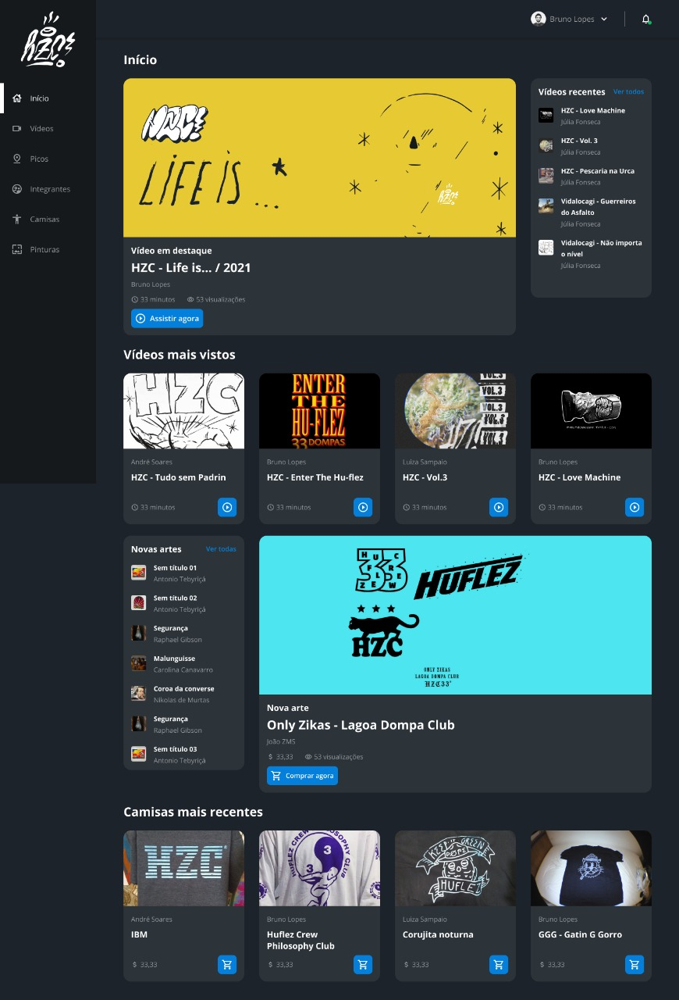

# HZC

### Tópicos

* Descrição do projeto
* Status do projeto
* Linguagens utilizadas 
* Acesso ao projeto
* Autora

## Descrição do projeto
O projeto HZC foi desenvolvido a partir de um [protótipo figma](https://www.figma.com/file/ibWktwVpnog76rMYOdVhks/Dispondo-elementos-com-flexbox-e-grid?node-id=72%3A4665) disponibilizado em um dos [cursos da escola front-end da Alura](https://www.alura.com.br/escola-front-end). 
Dessa forma, pude primeiro fazer o meu código e em seguida revisá-lo assistindo as aulas do curso e reparando onde poderia melhorar.

A partir desse projeto treinei: 
* conceito Mobile First;
* desenvolver o código a partir de um protótipo;
* posicionamento de elementos utilizando CSS Grid e Flexbox;

O projeto deixa o desafio de realizar duas telas a partir do conhecimento adquirido durante o curso, atualmente estou nessa etapa.

## Status do Projeto
Em andamento

## Linguagens Utilizadas
* HTML;
* CSS

## Acesso ao projeto
Você pode acessar o [código fonte do projeto](https://github.com/nalutm/hzc-skate-community) ou [baixá-lo](https://github.com/nalutm/hzc-skate-community/archive/refs/heads/main.zip). Também pode acessar a [página para conferir o resultado final](https://hzc-skate-community.vercel.app/)

## Autora
[Nayara Luiza Tavares Moraes](https://github.com/nalutm)

